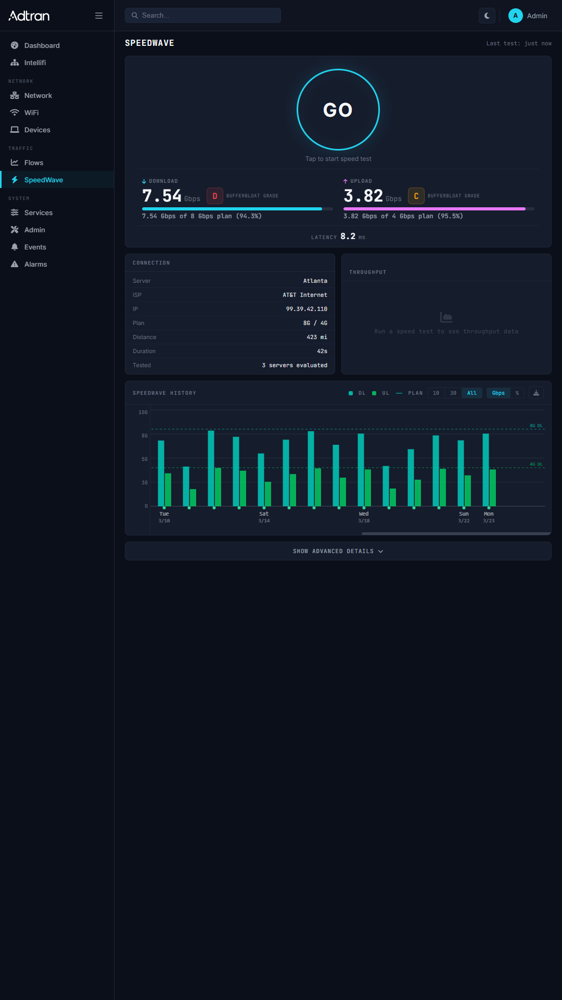
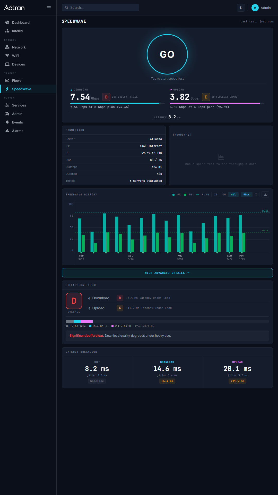
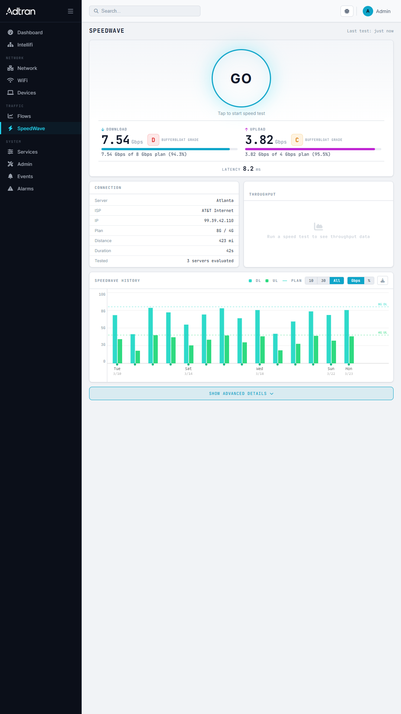

# SmartOS SpeedWave

Standalone prototype UI for the SmartOS BBST (Broadband Speed Test) page. Designed for firmware engineers to integrate into the JUCI AngularJS router UI.

## Features

- **Animated speed test** with multi-server ping race, real-time gauge, and throughput sampling
- **Bufferbloat grading** (A/B/C/D) with hover tooltips explaining each grade
- **WAN shaper configuration** modal for CoDel-based SQM, accessible from grade tooltips when bufferbloat is detected
- **Speed history chart** with 10/30/90/All day windows, raw/percentage toggle, hover tooltips, click drill-down, and JSON export
- **Real-time throughput chart** captured during each test
- **Latency breakdown** showing idle, download, and upload latency with jitter and delta values
- **Connection info** card with server, ISP, IP, plan rates, distance, and duration
- **Progressive disclosure** with basic view and expandable advanced details
- **Dark and light themes** with CSS custom properties

## Screenshots

### Main View (Dark Theme)


### Advanced Details


### Light Theme


## File Structure

```
index.html      Page structure (sidebar, topbar, speedtest content, shaper modal)
styles.css      Design system (CSS variables, dark/light themes, all component styles)
speedtest.js    Mock data, state machine, canvas rendering, animations, shaper config
```

No frameworks, no build step. Single HTML + CSS + JS.

## Mock Data

The prototype uses mock data matching the real BBST JSON output from `/tmp/bbst_results.json`. The mock includes:

- WAN service rates (download/upload)
- Latest test result with full speed, latency, and server selection data
- 30 historical test entries with varied results
- Simulated real-time throughput samples during test animation

## Integration Notes

For SmartOS/JUCI integration:

- Replace `MOCK` object with live ubus calls to `bbst` service
- Replace `shaperConfig` mock with UCI `sqm.wan` reads/writes via `$uci.$sync('sqm')`
- Real-time samples come from ubus event stream during active test
- Server selection data from `server_selection.servers[]` in BBST results
- Shaper uses CoDel (`fq_codel`) queuing discipline
- Enabling shaper should toggle `firewall.@defaults[0].flow_offloading`

## Running Locally

Serve the directory with any static file server:

```bash
python -m http.server 8091
# or
npx serve -p 8091
```

Open `http://localhost:8091` in a browser.
